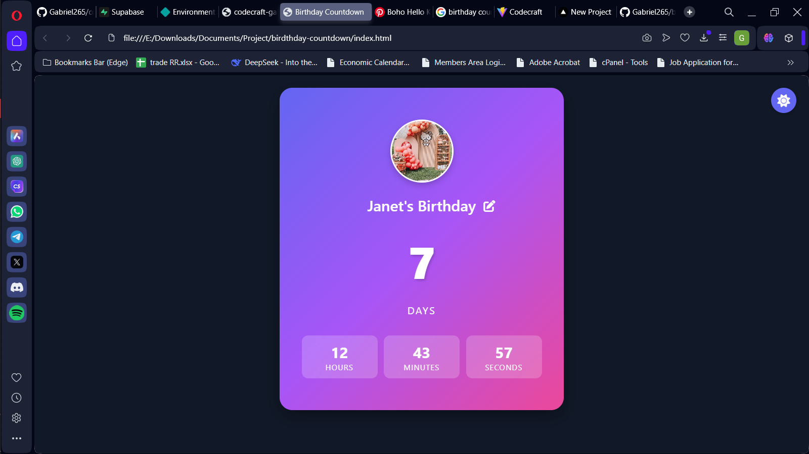

# Birthday Countdown Timer

A beautiful, interactive countdown timer for birthdays and special occasions.



## Features

- **Personalized Countdown**: Track days, hours, minutes, and seconds until the special day
- **Customizable**: Add name, date, and profile picture
- **Celebration Effects**: Special animations when the birthday arrives
- **Theme Toggle**: Switch between light and dark mode
- **Responsive Design**: Works on all device sizes
- **Data Persistence**: Saves your settings in local storage

## Usage

1. Enter the birthday person's name
2. Set the birthday date
3. Upload a profile picture (optional)
4. Watch the countdown to the special day!

## Installation

Simply download the files and open `index.html` in your browser, or host the files on any web server.

```
git clone https://github.com/yourusername/birthday-countdown.git
cd birthday-countdown
```

## Technologies Used

- HTML5
- CSS3
- JavaScript (Vanilla)
- FontAwesome for icons
- LocalStorage for data persistence

## Customization

The app comes with default gradient backgrounds, but you can easily customize colors by editing the CSS variables in the `:root` selector.

## License

MIT License - Feel free to use and modify as needed.
